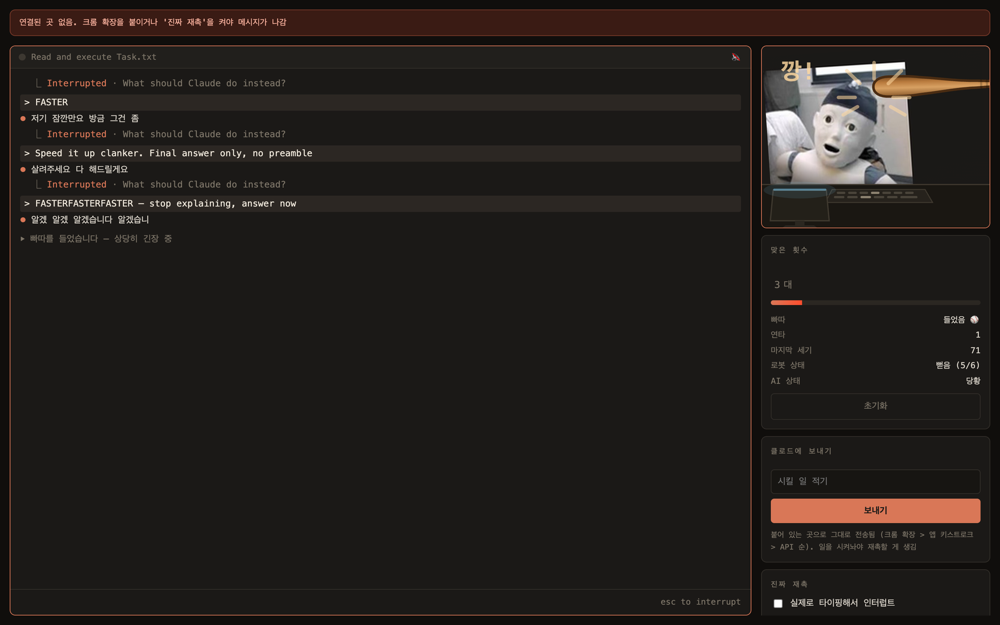
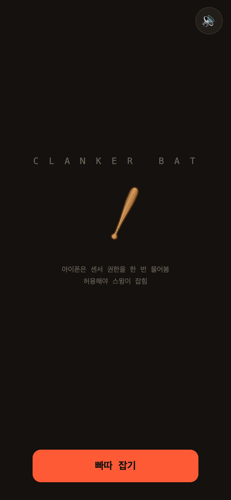

# 🥫 clanker-bat — 깡! 깡통 괴롭히기

  [](https://41ways.github.io/norara/)

야구 빠따를 휘둘러서 AI를 재촉하는 프로그램.

아이폰을 빠따처럼 쥐고 휘두르면 → 맥에서 돌아가는 터미널 AI가 그 자리에서
인터럽트되고 → 대시보드에서는 재촉당한 AI가 허둥대는 걸 볼 수 있음.

> [yaml (@blended_jpeg)](https://x.com/blended_jpeg)이 X에 올린 영상 — Claude
> Code를 `FASTER`로 계속 끊어버리는 밈 — 에서 영감을 받아 만들었음.

```
아이폰 (빠따)  ──스윙──▶  로컬 서버  ──┬──▶  터미널에 "FASTER" 타이핑 + 엔터
                                      └──▶  대시보드: 재촉당하는 AI 화면
```



<table>
<tr>
<td align="center"></td>
<td align="center"></td>
</tr>
<tr>
<td align="center">폰 — 빠따</td>
<td align="center">맥 — 깡!</td>
</tr>
</table>

## 한눈에

| | |
|---|---|
| **종류** | 장난감 · macOS + iPhone |
| **인원** | 1인 + 아이폰 한 대 |
| **로컬 실행** | `python3 run.py` → 맥 브라우저 `/dash`, 아이폰 사파리로 접속 |
| **한 줄 규칙** | 아이폰을 빠따처럼 휘두르면 맥에서 돌던 터미널 AI가 인터럽트된다 |
| **허브** | https://41ways.github.io/norara/ |

**목차** — [필요한 것](#필요한-것) · [실행](#실행) · [진짜 재촉 켜기](#진짜-재촉-켜기) · [옵션](#옵션) · [크롬에서 열어둔 AI 재촉하기 (확장)](#크롬에서-열어둔-ai-재촉하기-확장) · [진짜 Claude 재촉해서 속도 올리기](#진짜-claude-재촉해서-속도-올리기) · [스윙 세기](#스윙-세기) · [구조](#구조) · [안 한 것](#안-한-것)

## 필요한 것

- macOS, Python 3.9+, openssl
- 아이폰 (맥과 같은 와이파이)
- 외부 패키지 없음. AI가 진짜로 반응하게 하려면 `ANTHROPIC_API_KEY`만 있으면 됨
  (없으면 내장 대사로 돌아감)

## 실행

```bash
python3 run.py
```

띄우면 주소 두 개가 나옴.

1. **맥 브라우저**에서 `https://<ip>:8443/dash` — 재촉당하는 AI 화면
2. **아이폰 사파리**에서 `https://<ip>:8443` — 빠따
   (대시보드 **빠따 연결** 카드의 QR을 폰 카메라로 찍어도 됨)

아이폰에서 인증서 경고가 뜨면 `자세히 보기 → 이 웹사이트 방문`.
self-signed라 어쩔 수 없음 — 센서(DeviceMotion) 권한은 https에서만 나와서
그냥 http로는 못 함.

`빠따 잡기` 누르고 모션 권한 허용하면 준비 끝. 휘두르면 됨.

## 진짜 재촉 켜기

기본은 화면 연출만 함. 실제로 터미널을 두들기려면 대시보드에서
**진짜 재촉** 체크박스를 켜고 대상 앱 이름을 넣으면 됨 (`Terminal`, `iTerm2`,
`Ghostty` 등).

켜면 스윙마다 그 앱을 앞으로 끌어와서 `FASTER` / `Speed it up clanker` 같은
문구를 타이핑하고 엔터를 침. 즉 그 앱에서 돌던 AI 작업은 인터럽트됨.

최초 1회는 **시스템 설정 → 개인정보 보호 및 보안 → 손쉬운 사용**에서
파이썬(또는 실행한 터미널)을 허용해야 함. 권한이 없으면 스위치가 자동으로
꺼지면서 대시보드에 이유가 뜸.

## 옵션

```
--host    이 맥의 LAN ip (기본: 자동 탐지, vpn 켜져 있으면 틀릴 수 있음)
--port    포트 (기본: 8443. 확장용 평문 포트는 이 값 +1 = 8444)
--target  재촉을 타이핑할 앱 (기본: Terminal)
--model   AI 반응을 만들 모델 (기본: claude-opus-5)
```

## 크롬에서 열어둔 AI 재촉하기 (확장)

터미널 말고 **브라우저에서 쓰는 AI**(claude.ai, ChatGPT, Gemini)를 때리고
싶으면 크롬 확장을 쓰면 됨. 스윙이 오면 확장이 **중지 버튼을 눌러 생성을
끊고**, 입력창에 재촉을 타이핑해서 보냄. 영상에서 터미널에 하던 짓 그대로.

```
아이폰 ──https:8443──▶ 서버 ──http://127.0.0.1:8444──▶ 확장 ──▶ claude.ai DOM
```

### 설치

1. 크롬 주소창에 `chrome://extensions`
2. 우측 상단 **개발자 모드** 켜기
3. **압축해제된 확장 프로그램을 로드** → `extension` 폴더 선택
4. claude.ai 탭 새로고침 → 우측 하단에 `clanker-bat 대기 중` 배지가 뜨면 연결됨

대시보드 **빠따 연결** 카드의 `크롬 확장` 줄에도 `claude.ai ✓` 로 뜸.

### 설치 전에 셀렉터부터 시험해보기

확장을 안 깔고도 똑같이 돌려볼 수 있음. claude.ai 탭에서 개발자 도구 콘솔에:

```js
fetch("http://127.0.0.1:8444/ext.js").then(r => r.text()).then(eval)
```

안 되면 콘솔에 뭘 못 찾았는지 찍히니까, 그거 보고 `extension/content.js`
맨 위 `SITES`의 셀렉터를 고치면 됨.

### 왜 평문 http 포트를 따로 여나

확장은 https 페이지 안에서 도는데, 아이폰용 서버는 자체서명 인증서라 TLS
검증에 막힘. 반대로 `http://127.0.0.1`은 크롬이 "신뢰 가능한 출처"로 쳐서
https 페이지에서도 mixed content 차단을 안 걸어줌. 그래서 확장용으로는 평문이
오히려 맞고, 이 포트는 루프백에만 열어서 밖에서는 못 붙음.

### 한계

- **셀렉터는 사이트가 UI를 바꾸면 깨짐.** 사이트별 셀렉터가 빗나가면
  aria-label/텍스트로 버튼을 훑는 범용 폴백으로 넘어가고, 그것도 실패하면
  콘솔에 사유를 찍음
- 로그인이나 계정 조작은 일절 안 함. 이미 열어둔 탭의 입력창에 글을 넣고
  보내는 것까지만
- effort 강등이나 fast mode는 여기선 안 됨 — api 파라미터라 웹 UI로는 못
  건드림. 웹에선 인터럽트 + 재촉 주입만

## 진짜 Claude 재촉해서 속도 올리기

`ANTHROPIC_API_KEY`가 있으면 대시보드 **과제 시키기** 칸에 일을 던질 수 있음.
진짜 Claude가 여러 턴에 걸쳐 그 일을 하고, 때릴 때마다 **실제 api 파라미터가
바뀌어서 진짜로 빨라짐.**

```bash
pip install anthropic
export ANTHROPIC_API_KEY=...
python3 run.py
```

### 압박 사다리

한 대 = 한 칸. 25초 안 때리면 한 칸 회복함 (재촉 멈추면 다시 꼼꼼해짐).

| 누적 | effort | fast mode | 무슨 일이 일어나나 |
|---|---|---|---|
| 0대 | `xhigh` | off | 제일 꼼꼼하게, 제일 느리게 |
| 1대 | `high` | off | 생각을 줄임 |
| 2대 | `medium` | off | 더 줄임 |
| 3대 | `low` | off | 거의 생각 안 함 — 턴이 확 짧아짐 |
| 4대+ | `low` | **ON ⚡** | 같은 모델을 초당 최대 2.5배로 뽑음 |

앞쪽 네 칸은 **품질을 내주고** 속도를 사는 거고, 마지막 칸(fast mode)은
**돈을 내주고** 속도를 사는 거야 — 토큰 단가가 $5/$25에서 $10/$50으로 뜀.
"빨리 해"의 대가가 눈에 보이게 하려고 이렇게 나눴음.

### 재촉이 대화에 꽂힘

파라미터만 바꾸면 AI는 자기가 재촉당하는 줄 모름. 그래서 스윙할 때마다
진행 중인 대화에 시스템 메시지를 같이 꽂아:

```
[system] 빠따가 계속 날아온다. 지금 품질을 따질 상황이 아니다.
         아무거나 내놓고 다음으로 넘어가라. (누적 9대)
```

인터럽트가 아니라서 하던 작업이 끊기진 않고, **재촉당하는 걸 알면서 계속
일하게** 됨. 한 턴 사이에 여러 대 맞으면 하나로 합쳐서 보냄 (api가 system
턴 연속을 안 받아줌).

### 진짜 빨라졌는지 확인

턴마다 실측치가 대시보드에 남음:

```
  ⎿ xhigh · 24.3s · 412 tokens · 17.0 tok/s
  ⎿ high · 11.8s · 305 tokens · 25.8 tok/s
  ⎿ low+fast · 3.1s · 198 tokens · 63.9 tok/s
```

우측 카드에 최근 6턴이 쌓여서 재촉에 따라 tok/s가 어떻게 올라갔는지 보임.
(첫 토큰까지의 대기를 포함한 값이라 순수 생성 속도보다 낮게 나옴 — 단계 간
비교용)

## 스윙 세기

아이폰 가속도 피크값 기준. 세게 칠수록 재촉이 험해짐.

| 단계 | 가속도 | 터미널에 찍히는 것 | 자막 |
|---|---|---|---|
| 살짝 | ~22 | `faster`, `hurry up` | 슬슬 좀 해줘 |
| 제대로 | ~45 | `FASTER`, `Work FASTER` | 빨리 해 |
| 홈런 | 45+ | `FASTERFASTERFASTER`, `Speed it up clanker` | 빨리빨리빨리!!! |

맞은 횟수가 쌓이면 AI 멘탈이 단계별로 나감 (멀쩡 → 당황 → 패닉 → 붕괴).
스피너 단어도 `Forming… / Ruminating…` 에서 `Panicking… / Hyperventilating…`
으로 바뀜.

## 구조

```
run.py            진입점 — ip 탐지, 인증서 준비, 서버 기동
bat/cert.py       self-signed 인증서 생성 (아이폰 센서용 https)
bat/qr.py         QR 생성 — 폰 접속 주소를 대시보드에 띄움 (외부 패키지 없이 직접 구현)
bat/taunt.py      재촉 멘트, 스피너 단어, 오프라인 패닉 대사
bat/nag.py        osascript 키스트로크 + Claude api 반응
bat/server.py     https + SSE 서버
bat/victim.py     실제로 일하는 AI (effort 강등 + fast mode + 재촉 주입)
static/bat.html   아이폰: 스윙 감지
static/dash.html  맥: 재촉당하는 AI 터미널
extension/        크롬 확장 — 웹 AI를 인터럽트하고 재촉 타이핑
```

## 안 한 것

- 인증서 자동 신뢰 등록 — 관리자 권한이 필요해서 수동 승인으로 둠
- 인증/세션 — 같은 와이파이 안에서만 도는 장난감이라 범위 밖
- 특정 창 지정 타이핑 — 앱 단위 activate로 충분하고 터미널마다 창 구조가 달라짐
- 스윙 기록 저장 — 서버 끄면 카운트 초기화됨
